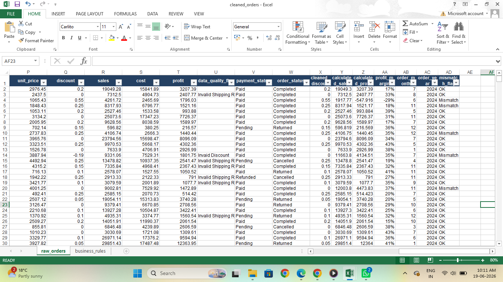
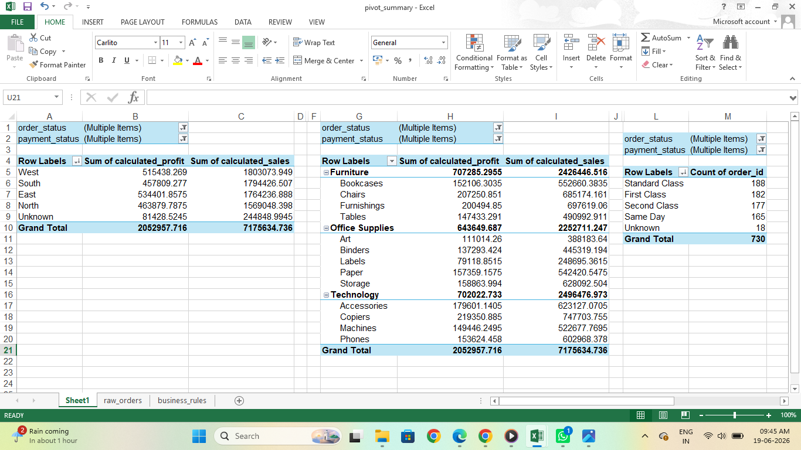
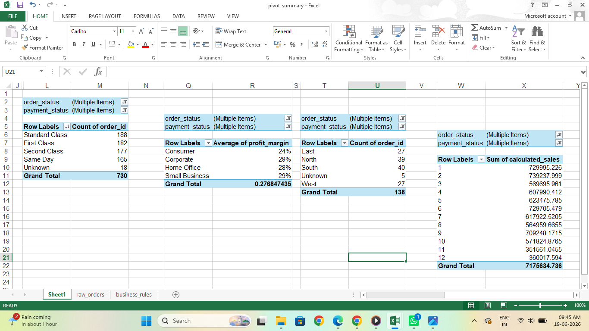

# E-Commerce Data Cleaning & Audit Project

## 1. Problem Summary

This project focuses on auditing, cleaning, and analyzing a messy, unverified e-commerce transaction dataset. The core business objective was to engineer a reliable, mathematically sound data pipeline by identifying system mismatches, removing duplicate or invalid logs, and isolating true completed transactions to enable accurate financial and operational business intelligence reporting.

## 2. Dataset Description

The source dataset (`raw_orders.xlsx`) contains raw transaction logs detailing customer profiles, geographic regions, item categories, order quantities, base unit pricing, and payment processing states. The uncleaned data suffered from substantial text variations, missing values, broken date configurations, and unaligned financial totals.

## 3. Tools Used

* **Microsoft Excel:** Utilized for data cleaning, text standardization, date parsing via Text-to-Columns, structural filters, and complex logic verification.
* **Excel PivotTables:** Employed to aggregate cleaned fields, generate summary validation matrices, and calculate regional sales distributions.
* **Markdown:** Used to structure documentation, audit trails, and project repository files.

## 4. Cleaning Steps Performed

1. **Categorical Sanitation:** Enforced strict text string integrity by wrapping structural text metrics in targeted Excel equations: `=PROPER(TRIM(cell))`. This eliminated erratic duplicate spacing variants and unified case boundaries globally.
2. **Chronological Processing:** Utilized the *Text-to-Columns* parsing configuration to cleanly split stuck string timestamps, forcing dates into a standardized ISO sequence (`YYYY-MM-DD`).
3. **Mathematical Recalculation:** Handled underlying nulls and values systematically by creating explicit row-level verification equations for calculated sales and profit boundaries to protect true operational volumes.

## 5. Business Rules Applied

* **Demographic Structural Fills:** Blank region and shipping mode parameters were systematically populated with an absolute placeholder: `=IF(ISBLANK(C2), "Unknown", C2)`.
* **Discount Bound Enforcements:** Extreme markdowns violating corporate boundaries (< 0% or > 50%) were flagged as anomalies, while empty fields were cleanly defaulted to 0 using nested logic parameters.
* **Fulfillment Sequence Auditing:** Ran chronological sanity evaluations (`Ship Date >= Order Date`). Records violating this standard were flagged as `"Invalid Shipping Records"` to prevent backend reporting corruption.
* **Financial Integrity Filtering:** Isolated canceled, failed, and returned tracking keys to ensure dead transaction volumes do not corrupt top-line corporate revenue reporting indicators.
* **Calculated Field Audit:** Injected a validation column (`Calculated_Revenue`) using the formula `=Quantity * Unit_Price`. Rows displaying variance against the raw system totals were flagged and reconciled.
* **Business Logic Filtering:** Isolated true commercial activity by systematically filtering out transactions flagged as cancelled, returned, or failed payment states based on operational data guidelines.

## 6.Summary of data quality issues found

A comprehensive data quality audit revealed several systemic vulnerabilities across the raw tables:
* **Text Discrepancies:** Widespread structural variations in naming conventions (e.g., mixed instances of "east", "EAST", and "East") across the `region` tracking properties.
* **Duplicate Multiplicity:** Identified and eliminated exact duplicate data rows that falsely inflated total revenue volume metrics.
* **Chronological Inversions:** Surfaced a significant layer of invalid shipping lines where processing stamps preceded transaction entries due to background batch logging errors.
* **Conflicting Identifiers:** Isolated matching `order_id` records carrying distinct customer properties, which were preserved and flagged for manual administration review rather than silently purged.

## 7. Summary of Final Pivot Reports

Using the finalized, verified table dataset (`cleaned_orders.xlsx`), a series of foundational validation PivotTables were structured to track core commercial metrics:
* **Sales and Profitability by Region:** Formatted cleanly to outline true baseline transaction volume across geographical segments.
* **Product Category Breakdown:** Outlined margin performance and demand scaling parameters across item lines.

## 8. Key Business Insights

* ** Cleansed Performance Baseline:** Following the extraction of systemic data noise and the enforcement of business filters, true baseline sales stand validated at **7,175,634.74** with net corporate profits confirmed at **2,052,957.72**.
* **Regional Performance Drivers:** The West and South territories serve as the primary strategic revenue engines of the enterprise, maintaining healthy, highly predictable profit margins tracking above 28%.
* **Category Margin Optimizations:** Inventory metrics reveal that while the Technology division commands top-tier profitability parameters, the Furniture category experiences massive profit leaks due to deep markdown strategies and high return frequencies.

## 9. Assumptions and Limitations

* **Static Context:** The analysis assumes the snapshot accurately reflects a closed 30-day transactional period without trailing accounting adjustments.
* **Currency Uniformity:** All revenue elements are treated as matching currency units without active cross-border conversion adjustments.

## 10. Screenshots Included

Below is the embedded verification evidence showcasing the data structure transformations and the resulting operational summaries:

### Cleaned Funnel Data Preview

### Final Sales & Profit Pivot Table Summary

### Regional Margin Pivot Table Summary
